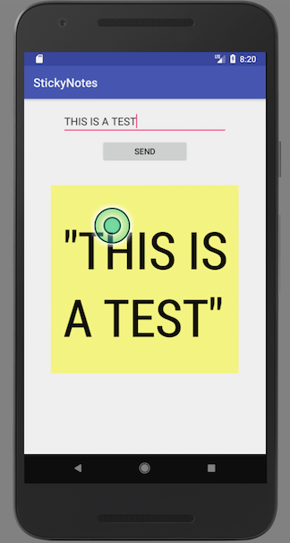

# android app client and a REST API for a simple stickynotes backend
This tutorial contains a android app client for a back end service that received a message as parameter and generates an
image with the text and sent it back to the app for rendering. Backend server is written in Go and enables a REST API for
receiving the message and generate the image and send it back to client. It based in one google app tutorial.
Server can run in local machine or external machine. It is necessary to install Go and change on android app the server url
and port for connection.
KeyWords :REST API, Android app, Go, Google Compute Engine.

### Android Client

